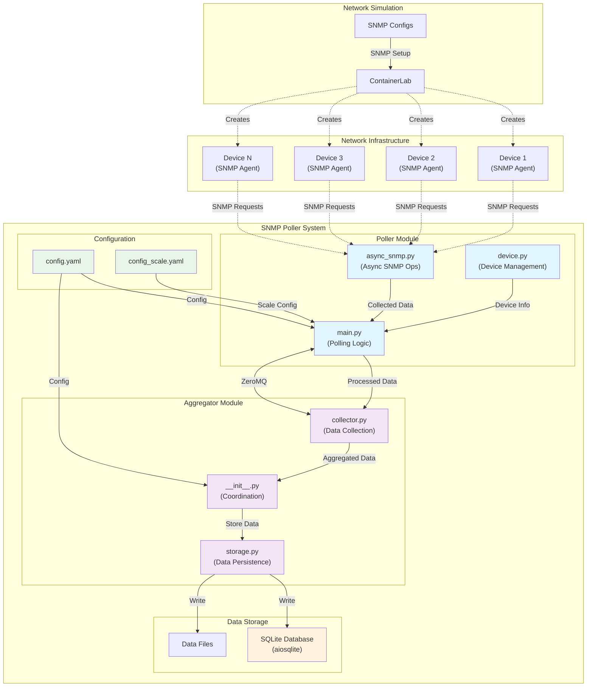

# SNMP Poller Architecture

## Overview

The SNMP Poller is a distributed system designed for efficient collection and processing of SNMP data from network devices. It follows a modular architecture that separates concerns between data collection, processing, and storage.

## System Components

### 1. Poller Module
- **Purpose**: Handles SNMP data collection from network devices
- **Key Components**:
  - `async_snmp.py`: Asynchronous SNMP operations
  - `device.py`: Device management and configuration
  - `main.py`: Main polling logic and coordination

### 2. Aggregator Module
- **Purpose**: Processes and aggregates collected SNMP data
- **Key Components**:
  - `collector.py`: Data collection from pollers
  - `storage.py`: Data persistence and management
  - `__init__.py`: Aggregator initialization and coordination

### 3. Configuration Management
- **Location**: `config/` directory
- **Purpose**: Manages system configuration and device settings
- **Files**:
  - `config.yaml`: Main configuration file
  - `config_scale.yaml`: Configuration for scaled testing

### 4. Data Storage
- **Location**: `data/` directory
- **Purpose**: Stores collected metrics and system data
- **Format**: SQLite database (using aiosqlite)

## Communication Flow

1. **Device Discovery**:
   - System reads device configurations from YAML files
   - Establishes SNMP connections to target devices

2. **Data Collection**:
   - Poller module asynchronously collects SNMP data
   - Uses PySNMP for SNMP operations
   - Implements efficient polling strategies

3. **Data Processing**:
   - Aggregator receives data from pollers
   - Processes and normalizes the data
   - Stores results in the database

4. **Data Storage**:
   - Asynchronous database operations
   - Efficient data organization
   - Quick retrieval capabilities

## System Architecture Diagram

## Technical Stack

- **Language**: Python 3.8+
- **Key Dependencies**:
  - pysnmp (6.2.6): SNMP operations
  - pyyaml (6.0.1): Configuration management
  - pyzmq (25.1.2): Inter-process communication
  - aiosqlite (0.17.0): Asynchronous database operations

## Scalability Features

1. **Asynchronous Operations**:
   - Non-blocking SNMP operations
   - Efficient resource utilization
   - High concurrency support

2. **Modular Design**:
   - Independent components
   - Easy to extend and modify
   - Clear separation of concerns

3. **Configuration Flexibility**:
   - Dynamic device management
   - Adjustable polling parameters
   - Scalable testing configurations

## Future Enhancements

1. **Planned Features/Improvements**:
   - Stored polled data in the form of blob
   - Configured config to work for different zones
   - Implementation of CurveMQ and ZAP to authenticate the pollers with correct aggregator
   - Different polling interval for different matrices

